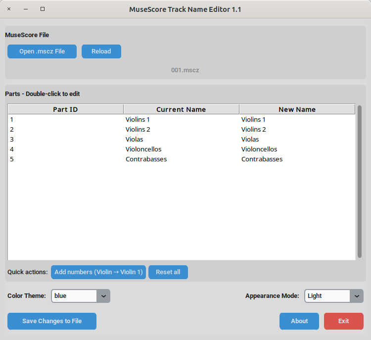

[](https://www.gnu.org/licenses/gpl-3.0.en.html)

# MuseScore .mscz trackname editor

---



## Features 

- Modify tracknames in MuseScore .mscz files to
    - Fix concatenation issues by standardizing part names
    - Change track name in the mixer
    - Change track name in MIDI export
- Automatic backup creation
- Auto-Numbering: Automatically resolve duplicate part names
- Light/Dark theme, with color options

---

## Usage

### Option 1 — Use the prebuilt executables

#### **Linux**
Download the native executable mscz-trackname-editor
Then make it executable and run:
```bash
chmod +x mscz-trackname-editor
./mscz-trackname-editor
````

#### **Windows**
Download: mscz-trackname-editor.exe
Then double-click to launch. No installation required.

### Option 2 — Run from source (Linux / Windows)

Download mscz-trackname-editor.py

Run the GUI:
```bash
python3 mscz-trackname-editor.py
````

---

## License

This application is licensed under the **GPLv3 License**. See the `LICENSE` file for details.

---

## Support
For issues or questions, please use Issues menu in this repository.
